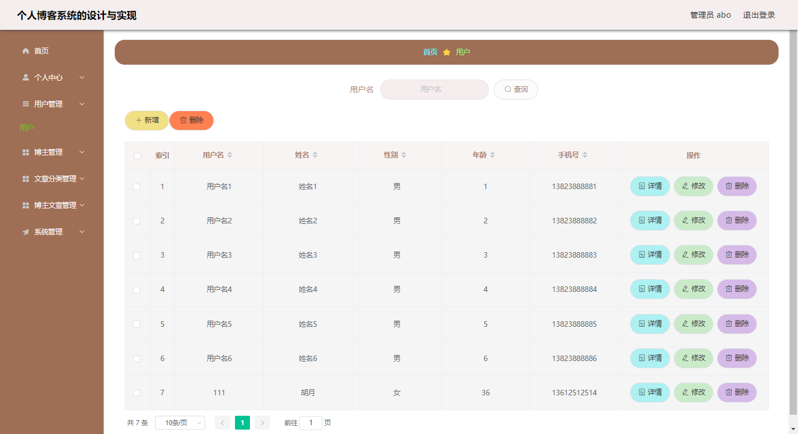
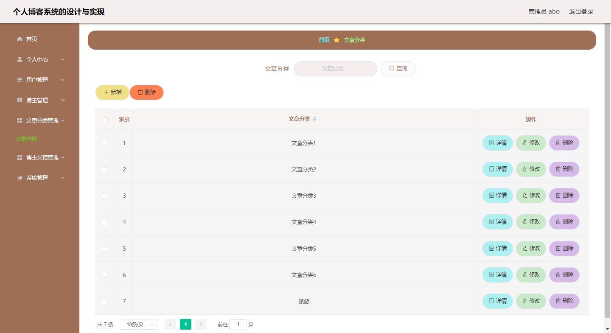
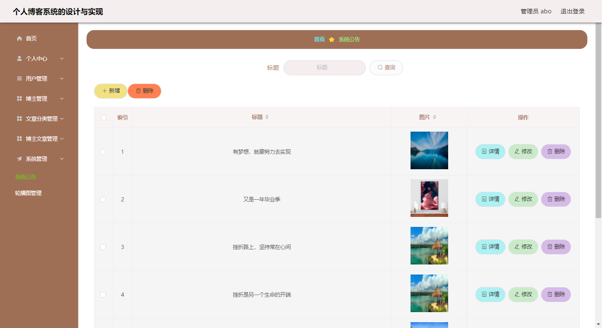
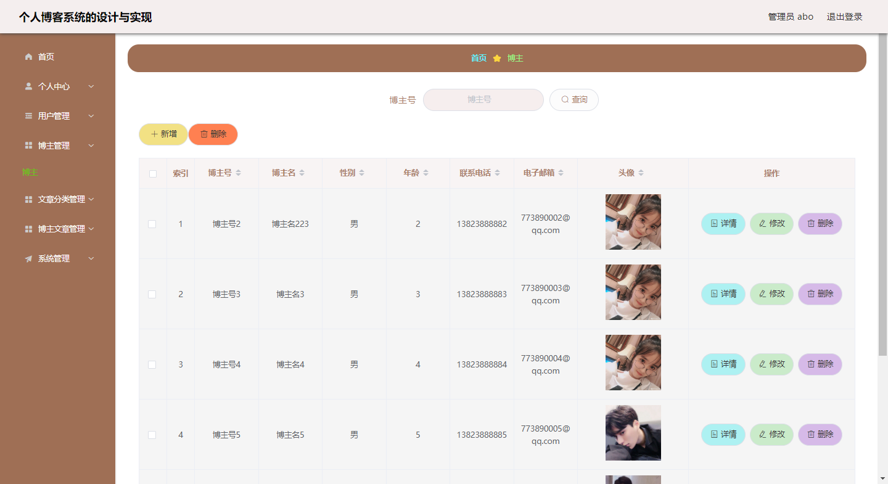
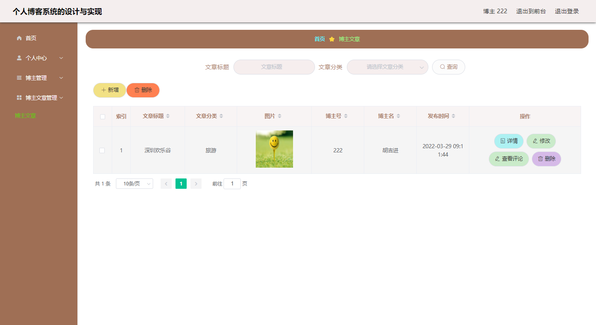
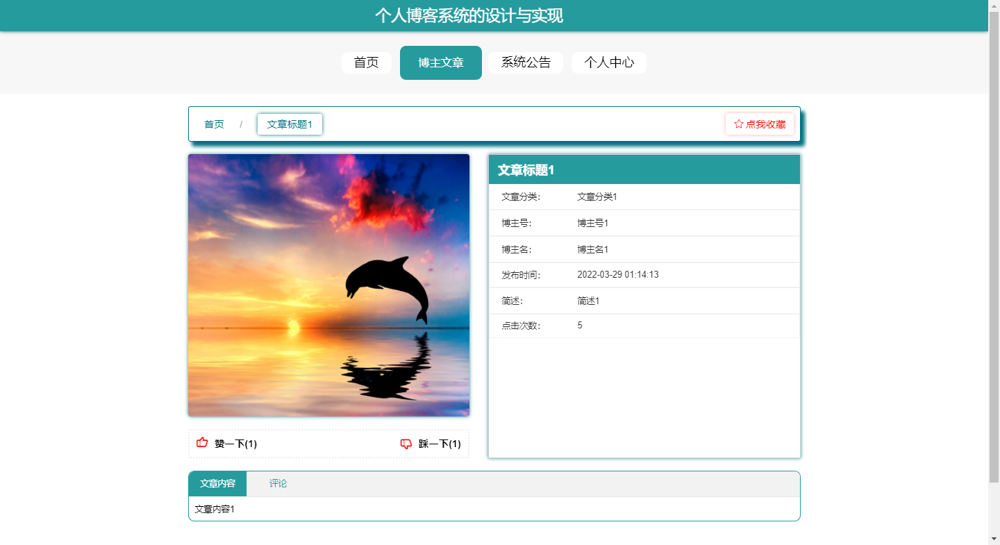
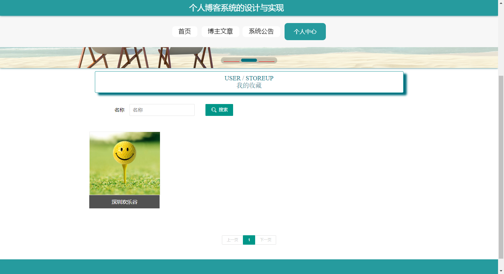

**项目简介：**  
本项目基于主流的前后端分离架构，采用 **SpringBoot + Vue 技术栈**，配套 **MySQL 数据库**，适用于毕业设计与课题实训开发。  
本人已整理了超 **4000 多套毕业设计源码+论文+开题报告+PPT...**，涵盖 **Java、SpringBoot、Vue、SSM、uni-app 小程序、PHP、Android** 等方向，支持功能修改定制与论文服务。  
**团队提供以下服务：**  
- 项目代码修改与调试  
- 数据库配置与远程协助  
- 论文定制与修改  
**获取更多的4000多套源码或SQL文件请联系：**  
- QQ：3906443360 微信：BesheHelp

# springboot200个人博客系统的设计与实现

## 4 系统设计

系统分析接下来的操作步骤就是系统的设计，这部分内容也是不能马虎对待的。因为生活都是在不断产生变化，人们需求也是在不断改变，开发技术也是在不断升级，所以程序也需要考虑在今后可以方便进行功能扩展，完成升级。程序也需要具备大容量以及对其它软硬件的适应能力，而不仅仅是满足现有用户提出来的功能需求，程序在设计期间始终要以发展的理念来进行，要让程序的开发技术上具备先进性的特点，也要让程序开发成本降低，以及让程序后期运行使用时易于维护。

4.1 系统结构设计

本程序在设计结构选择上首选B/S，也是为了满足程序今后升级便利，以及程序低维护成本的要求。本程序的网络拓扑设计也会在下图展示，通过图形的方式来描述更容易理解。

图4.1 系统网络拓扑设计图

4.2系统功能模块设计

程序的功能在系统分析这部分已经确定了，这部分主要还是针对程序功能进行更加详细的设计，设计成果使用结构图展示直观明了，也更容易让人理解。绘制结构图采用的工具是Visio，使用它可以快速绘制出不同角色拥有的功能结构。

图4.2 功能结构图

4.3数据库设计

对程序的功能分析与结构设计之后，也要对程序数据存储的工具进行选择，本程序选用的数据存储仓库是Mysql，选用这个工具就需要根据该数据库的特点进行数据库文件的创建，并设计与之对应的数据表。

4.3.1数据库E-R图

设计一个数据库，不仅包含了数据库实体的设计，也包括了数据库表的结构设计，此部分内容设计的就是确认数据库的实体，并在此基础上对每个实体应该有的属性值进行分析设计，这些确认好的属性值对接下来的数据表的设计也是有很大帮助的，因为它们代表数据表里面的字段值。通常每个程序的数据库里面都具备用户这样的一个数据表。那么在分析用户这个实体的时候，都会设计出它的属性，有最基本的登录程序的账号属性，有用户的姓名属性，有用户的电话或联系地址属性等内容。一旦确认实体具备的属性之后，就可以采用相应的设计软件绘画出实体属性图，或者是实体之间的E-R图。设计E-R模型的软件有很多，这里列举常用的几个，一个是PowerDesigner，一个是Navicat绘制E-R模型，本设计模块用到的还是之前课堂上就了解并接触的Visio工具，这个工具跟办公软件Word，Excel一样都属于Office里面的一部分。使用Visio工具不仅在软件安装上快捷高效，而且它不会占用很多计算机的存储空间。

（1）个人博客系统设计了管理员实体，管理员实体属性图会在下图进行展示，此图的绘制工具是Visio工具。

图4.4 管理员实体属性图

（2）个人博客系统设计了用户实体，用户实体属性图会在下图进行展示，此图的绘制工具是Visio工具。

图4.5 用户实体属性图

（3）个人博客系统设计了文章分类实体，文章分类实体属性图会在下图进行展示，此图的绘制工具是Visio工具。

图4.6 文章分类实体属性图

4.3.2 数据库表结构

在上述内容中，已经设计出相应的E-R模型，就可以在数据库里面根据各个实体创建相应的数据表，不过在初次使用数据库工具的时候，是需要创建一个针对程序的数据库文件，有了此步操作之后，才在刚创建的数据库文件里面创建数据表，创建数据表需要涉及到字段的设计，主键的设计，字段长度与类型的设计等内容，只有设计好的数据表结构才可以按照此规则存放对应的程序数据。这里举个例子，就拿上面提到的用户实体来说吧，用户具备的属性值，比如账号，比如联系方式与电话等都可以设计成该用户数据表里面的字段，然后对这些字段设计其数据类型，长度，并选择该表的主键作为此用户数据表的唯一标志。数据库里面的各个数据表都有它们的主键，这样也是为了方便区分各个数据表。

1系统公告表

2博主文章表

3博主文章评论表

4博主表

5用户表

6文章分类表

7收藏表

8配置文件表

9用户表

10token表

5 系统实现

对个人博客系统进行了前面的系统分析，系统设计之后，接下来的环节就是个人博客系统的具体编码实现功能的部分。这部分内容会显示系统各个功能的具体界面运行效果。

5.1 管理员功能实现

5.1.1 用户管理

管理员可以对用户信息进行添加，修改，删除，查询操作。

图5.1 用户管理页面

5.1.2 文章分类管理

管理员可以对文章分类信息进行添加，修改，删除，查询操作。

图5.2 文章分类管理页面

5.1.3 公告信息管理

管理员可以对公告信息进行添加，修改，删除，查询操作。

图5.3 公告信息管理页面

5.1.4 博主信息管理

管理员可以对博主信息信息进行添加，修改，删除，查询操作。

图5.4 博主信息管理页面

5.2 博主功能实现

5.2.1 博主文章管理

博主可以对自己发布过的博主文章信息进行添加，修改，删除，查询操作，还可以查看评论。

图5.5首页页面

5.3 用户功能实现

5.3.1 博主文章信息

用户可以在博主文章里面查看到博主发布的文章信息，可以对博主文章信息进行查看，收藏，赞踩，评论操作。

图5.6 博主文章信息页面

5.3.2 我的收藏

我的收藏里面可以看到自己收藏过的博主文章信息，可以去点击收藏的信息去取消收藏。

图5.7 我的收藏页面

